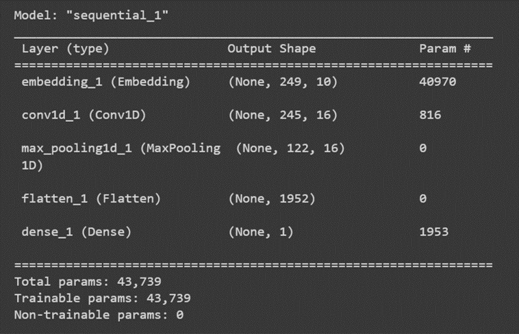

# Gene pediction from metagenomics dataset 

> The study objective: NLP for gene predictions. 

## Table of contents
* [General info](#general-info)
* [NLP - Gene Predictions](#Link)
* [Packages and approaches](#R)
* [Status](#status)
* [Inspiration](#inspiration)
* [Files](#files) 

## General info
There is great a need for the prediction of genes from fragemtned metagenomics dataset.

## NLP - Gene Predictions
NLP has the potential to address the need for identification of coding ORFs.

[NLP - Gene Predictions](https://www.hindawi.com/journals/bmri/2017/4740354/)

## Packages and approaches
keras, sklearn, pandas, numpy

#### Code Example - NLP network 
    model = Sequential()
    model.add(Embedding(vocab_size, 10, input_length = max_length))
    model.add(Conv1D(filters = 16, kernel_size = 5, activation = 'relu'))
    model.add(MaxPooling1D(pool_size = 2))
    model.add(Flatten())
    model.add(Dense(1, activation = 'sigmoid'))

    epochs = 100
    lrate = 0.01
    decay = lrate / epochs
    sgd = SGD(lr = lrate, momentum = 0.9, nesterov = False)
    model.compile(loss = 'binary_crossentropy', optimizer = sgd, metrics = ['binary_accuracy'])
        
 #### Code Example - model.fit
     history = model.fit(X_train , y_train, 
                    epochs = 100, verbose = 2, validation_split = 0.30, batch_size = 32, shuffle = True)
                
 

#### Let's evaluate the model on the test data.
    print("Evaluate on test data")
    results = model.evaluate(X_test, y_test, batch_size=128)
    print("test loss, test acc:", results)

 
## Status
Project is completed.

## Inspiration
Application of Deep Learning approaches for novel gene predictions using metagnomics datasets as input.

## Files 
Ref codes: https://github.com/melaniaAB/NLP_Gene_Predictions.git

